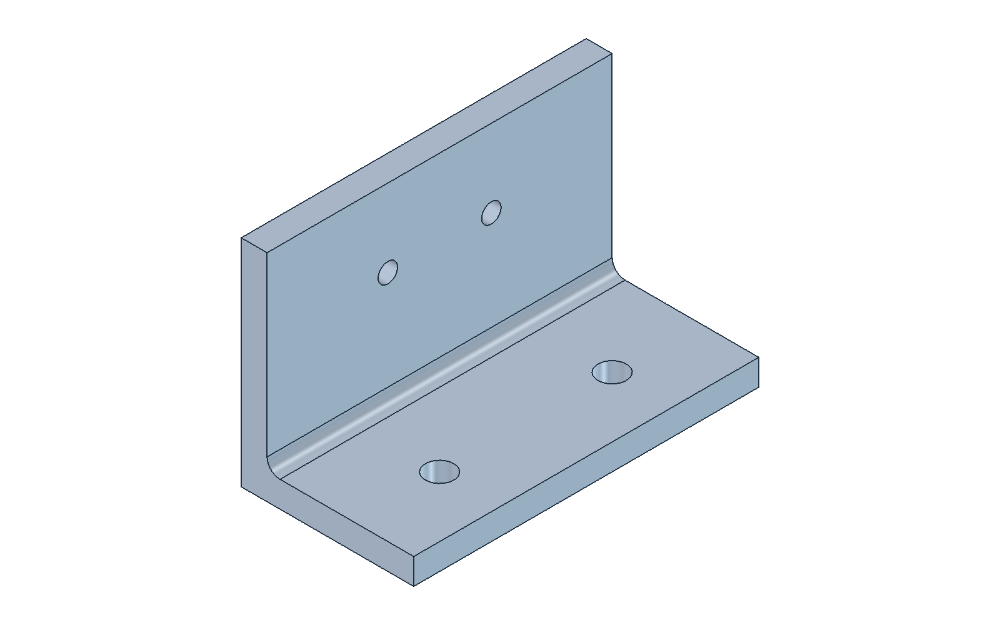

# Automotive CAD Copilot

A Codex-driven FreeCAD workflow that creates an editable sensor mounting bracket, revises dimensions, checks geometric requirements, and exports engineering artifacts.

The example is synthetic automotive packaging geometry. It demonstrates CAD automation and design intent, with explicit limits on what has been validated.

[Watch the 75-second walkthrough](artifacts/demo/automotive-cad-copilot.mp4) | [View the inspection drawing](artifacts/examples/baseline/drawing.pdf) | [Read the benchmark](artifacts/benchmark/summary.md)



## First time using this project

Download the [complete beginner handover pack](https://github.com/vinayanand3/automotive-cad-copilot/raw/refs/heads/main/docs/Automotive-CAD-Copilot-Handover-Pack.zip), extract it, and open `START-HERE.txt`. The 30-page guide assumes no previous knowledge of this project and explains installation, creating and revising CAD, inspecting artifacts, testing expected failures, and troubleshooting.

| Resource | Use it for |
| --- | --- |
| [PDF guide](docs/handover/Automotive-CAD-Copilot-Handover.pdf) | Follow the illustrated setup and testing walkthrough |
| [Editable Word guide](docs/handover/Automotive-CAD-Copilot-Handover.docx) | Add handover notes or adapt the instructions |
| [Copyable instructions](docs/handover/guide.md) | Copy terminal commands and Codex prompts |
| [Scenario results sheet](docs/handover/results-template.csv) | Record ten conversational tests, timings, retries and interventions |
| [Tester notes form](docs/handover/tester-notes-template.txt) | Record the environment, acceptance checks and defects |

For a handover, send the ZIP and this repository link to the tester. The pack contains documentation and blank forms; the guide explains how to download the application code and install its prerequisites. Start at section 1, then return the evidence described in section 18. See the [handover overview](docs/handover/README.md) for version details.

The walkthrough targets **macOS Apple Silicon with FreeCAD 1.1.3**. Other platforms remain unverified. Existing repository results are reference evidence; each tester should record their own outcomes.

## Quick start

Requirements: Python 3.10+, FreeCAD **1.1.3** with its bundled Python, and Codex for the conversational workflow. The CLI has no third-party Python dependencies. macOS Apple Silicon is the tested platform. Other FreeCAD platforms need validation.

1. Install FreeCAD from the [official 1.1.3 release](https://github.com/FreeCAD/FreeCAD/releases/tag/1.1.3). The tested installer checksum is in `freecad-version.json`.
2. Open this repository as a Codex project. Its local `automotive-cad` skill is in `.agents/skills/automotive-cad`.
3. Start the FreeCAD bridge from the repository root:

```sh
scripts/start-freecad.sh
```

If FreeCAD is elsewhere:

```sh
FREECAD_BIN=/path/to/FreeCAD scripts/start-freecad.sh
```

Alternatively execute `freecad/StartCopilot.FCMacro` from FreeCAD's Macro dialog. Keep FreeCAD open. Restart the bridge/application after changing Python source files.

4. In another terminal, run:

```sh
python3 -m cadcopilot status
python3 -m cadcopilot build --preset sensor-bracket
python3 -m cadcopilot revise --patch examples/wider-spacing.json
python3 -m cadcopilot revise --patch examples/too-narrow.json
python3 -m cadcopilot validate
python3 -m cadcopilot export
```

The narrowing request should return `rejected`. It leaves only 1.7 mm from the hole rim to the edge, against the preset's 5 mm minimum. The last successful revision remains available.

With Codex, start with: **"Use $automotive-cad to create the supplied sensor-bracket preset, inspect its images and drawing, and show me the artifacts."** Then request 50 mm base-hole spacing with the sensor interface preserved. Finish by requesting 60 mm width to demonstrate conflict detection.

## Outputs

Each job writes to `.cadcopilot/revisions/<id>/`. Successful modeling jobs return absolute paths for:

- `bracket.FCStd`: native editable features and named parameters
- `bracket.step`: neutral solid export, reimported for verification
- `drawing.pdf` and `drawing.svg`: TechDraw inspection drawing
- `assembly.png` and `bracket.png`: geometry renders
- `spec.json`, `result.json`, and `report.md`: resolved inputs and checks

The JSON response includes status, revision ID, source revision, measurements, checks, errors, timing, runtime version and artifact paths. Exit code 0 means success or informational output; exit code 2 means rejection or operational failure. `--workspace` and `--timeout` precede the subcommand. Use an explicit revision ID for reproducible multi-step work.

A preflight check does not require FreeCAD:

```sh
python3 -m cadcopilot build --preset sensor-bracket --preflight-only
```

It checks the specification only and does not claim valid geometry.

## Tests and evidence

```sh
python3 -m unittest discover -s tests -v
python3 scripts/benchmark.py
```

The benchmark requires a running bridge. It replays ten fixed design scenarios and writes measured results under `artifacts/benchmark`. It is a scripted CLI test, not a blind conversational-agent evaluation. Every successful build includes geometry, STEP roundtrip, native reopen, and native parameter-edit checks. See the published benchmark report and case study for actual results and remaining evaluation work.

The CLI performs no network calls. Use `python3 -m cadcopilot` directly from the checkout, or `python3 -m pip install -e .` for the optional `cadcopilot` executable. Keep the checkout because presets and drawing assets are repository resources.

## Design and implementation

Read [the design contract](docs/design-contract.md) for coordinates and requirements, [architecture](docs/architecture.md) for the bridge and revision model, and [the case study](docs/case-study.md) for the engineering story.

The bracket uses native constrained sketches, pads, pockets and a concave fillet. Geometry checks use Open CASCADE solids and surfaces. The sensor and obstacles are simple reference boxes. Native manual edits can be validated; spec-driven revisions and exports use stored JSON, not arbitrary manual edits.

## Limits

This is one component family. It does not certify structural strength, fatigue, vibration, fasteners, tool access, GD&T or manufacturing readiness. The drawing is marked **not for manufacture**. Edge-distance and clearance thresholds are explicit project requirements. No measured manual-versus-automated time-saving claim has been made.

## License

MIT for this project's code, templates and synthetic examples. FreeCAD is a separate dependency under its own licenses.
