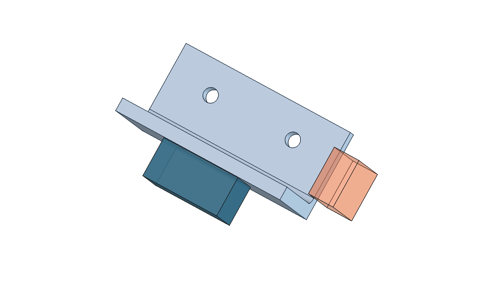

# Automotive CAD Copilot handover guide

Beginner installation, CAD creation and independent testing

Prepared for a first-time tester by Vinay Anand. Guide version 1.0, 6 September 2026. Workflow reviewed against code revision a60657a and FreeCAD 1.1.3 on macOS Apple Silicon. Record your own checkout version before testing.

## 1 Start here

This guide will help you install the project, create a sensor mounting bracket, change its mounting holes, check a deliberately impossible request, inspect the CAD files and report what happened. You do not need previous FreeCAD, Python or Codex experience. You should be comfortable installing an application, opening a folder and copying text.

The component is a synthetic automotive sensor bracket. It is a machined L-shaped concept with a rounded internal corner. It is not a real vehicle part or a manufacturing release. Your task is to test whether the workflow produces editable geometry, checks the stated requirements and preserves good work after a failed request.

**What completion looks like:** You have a baseline model, a revised model with 50 mm base-hole spacing, evidence that the 60 mm width request was rejected, readable exports, test results and a record of any help you needed. A rejection is a passing test when the requested geometry violates a requirement.

### Choose your testing route

- **First-time route:** Follow sections 2 through 10 in order. This establishes that the installed tools work before adding conversational interpretation.
- **Conversation route:** After the terminal walkthrough, follow sections 11 and 14 in Codex. This tests the assistant rather than only the CAD commands.
- **Complete handover:** Also run the automated checks in section 13, the input and recovery checks in section 15, and return the evidence described in section 18.
- **Review only:** If you cannot install the tested runtime, view the supplied example files and video. Record this as an artifact review, not a successful installation or CAD generation test.

Allow roughly 2 to 3 hours for installation and a careful first walkthrough, plus 1 to 2 hours for extended tests and notes. These are planning allowances, not measured performance claims. Downloads and unfamiliar software can take longer.

### What is already known

The project author recorded 19 passing automated contract and queue tests, ten passing scripted design scenarios, and checks for revision retention, native validation, export and timeout recovery. Your machine has not passed merely because those results exist. Run the checks and record your own evidence.

## 2 Understand the tools and the part

**CAD** means computer-aided design. A CAD solid describes a three-dimensional object. A **parametric model** records dimensions and construction operations so that a dimension can change and the shape can be recomputed. The **feature tree** lists those operations in order.

**FreeCAD** is the desktop application that creates and displays the solid. A **sketch** defines a constrained two-dimensional profile. A **pad** adds material; a **pocket** removes it. A **fillet** rounds a corner. A **datum** is a reference used to position a feature.

**Python** runs the project commands. You will use two Python environments: the Python installed on your Mac runs the command-line interface, while FreeCAD's bundled Python runs geometry operations. Do not try to install the FreeCAD geometry modules with pip into your normal Python.

**Terminal** is the Mac application where you paste commands. A **CLI**, or command-line interface, lets you request operations by typing. **JSON** is a structured text format containing names and values. The project uses a complete JSON specification for a new build and a smaller JSON patch for a revision.

**Codex** interprets an engineering request and calls these local commands. The project **skill** is a set of instructions that tells Codex what is supported. The **bridge** is the local worker running inside FreeCAD. It reads a file queue and returns the result. A **heartbeat** is a regularly updated file showing that the bridge is running.

The sequence is: request in Codex, specification or patch, Python command, FreeCAD bridge, editable geometry, validation, exported files. The terminal route starts directly at the Python command. The CAD CLI makes no network calls; the Codex conversation requires its own account access and connection.

### Read the geometry

X runs across the width, centered at zero. Y runs from the rear face toward the front edge of the base. Z runs upward from the underside. The sensor box sits behind the upright, touching the intended mounting face at Y = 0. The obstacle box represents space that the bracket and sensor must avoid. The envelope is the allowed box containing the bracket and sensor.



The image is an orientation aid. Use the measured values and checks to determine whether the model passes. Intended sensor contact is allowed; intersection with the obstacle is not.

## 3 Check your computer and install the applications

### Use the tested platform first

The demonstrated configuration is FreeCAD 1.1.3 on an Apple Silicon Mac, with Python 3.10 or newer for the CLI. FreeCAD uses its own bundled Python 3.11. Windows, Linux and Intel Mac operation have not been validated by this project. Do not treat these Mac commands as a tested cross-platform procedure.

On your Mac, open the Apple menu and choose About This Mac. Record the macOS version and chip. Apple M-series chips are Apple Silicon. Record an Intel machine as a different platform. There is no independently established minimum RAM or disk-space requirement for this project; ensure you have room for the applications, downloads and multiple CAD revisions.

### Install FreeCAD

1. Open the official release page: https://github.com/FreeCAD/FreeCAD/releases/tag/1.1.3.
2. Expand Assets if necessary. For the tested Mac platform, select FreeCAD_1.1.3-macOS-arm64-py311.dmg. Do not substitute a weekly build for this reproduction test.
3. Open the downloaded disk image. Copy FreeCAD.app into Applications and allow the copy to finish. Open the installed app from Applications, rather than running it from the disk image.
4. Check the application's About FreeCAD information and confirm version 1.1.3. Record the complete version information if your display differs.
5. Close FreeCAD normally after confirming that it starts. Later, you will reopen it using the project launcher so the bridge is active.

If macOS blocks installation, use your organization's approved installation process or report the block. Do not disable system security controls as a troubleshooting shortcut.

### Install ordinary Python

1. Open https://www.python.org/downloads/macos/ and download an official stable Python 3 installer compatible with your Mac. The CLI requires 3.10 or newer.
2. Run the installer and follow its prompts. Close and reopen Terminal afterward so the updated command path is loaded.
3. Press Command and Space, type Terminal and open it. Paste this command and press Return:

```sh
python3 --version
```

**Checkpoint:** The output begins with Python 3 and the minor version is at least 10. Python 3.9 does not meet the project's requirement. If several versions are installed, record which executable is being used with the command below.

```sh
command -v python3
```

The command route needs no third-party Python packages. You do not need a virtual environment or pip installation for this guide. Keep the project files together and run commands from the project root.

### Install Codex for the conversation route

Use the official app setup instructions at https://learn.chatgpt.com/docs/app and sign in with your own authorized account. Confirm that you can open a local project and run a local task. Account eligibility and available model names can change; record the model actually used rather than assuming a particular launch-blog model is required. You do not need a separate model API key, hosted service or plugin marketplace installation for this workflow.

You can complete the terminal and CAD checks without Codex access. Mark the conversation tests as not run if account access is unavailable.

## 4 Download the project and prepare Terminal

Repository: https://github.com/vinayanand3/automotive-cad-copilot

### Download without Git knowledge

1. Open the repository link in your browser. Select Code, then Download ZIP.
2. Open the downloaded ZIP to extract it. The folder will usually be named automotive-cad-copilot-main.
3. In Finder, open your home folder with Shift, Command and H. Create a folder named CAD-Testing if it does not exist.
4. Move the extracted project into CAD-Testing and rename the project folder automotive-cad-copilot. Keep the complete folder, including hidden files.
5. Open Terminal. Paste the following commands one at a time:

```sh
cd "$HOME/CAD-Testing/automotive-cad-copilot"
pwd
ls
ls -a .agents/skills/automotive-cad
```

**Checkpoint:** pwd ends in CAD-Testing/automotive-cad-copilot. The listing includes README.md, cadcopilot, examples, freecad and scripts. The final command lists SKILL.md. This folder is the **project root**. All commands in this guide run here unless explicitly stated otherwise.

If you used a different location, type cd followed by a space, drag the project folder from Finder into Terminal, and press Return. This inserts your actual path. Do this in every new Terminal window before running a project command.

### Optional download using Git

If you already have Git, this is an alternative to the ZIP route. Do not run both into the same destination.

```sh
mkdir -p "$HOME/CAD-Testing"
cd "$HOME/CAD-Testing"
git clone https://github.com/vinayanand3/automotive-cad-copilot.git
cd automotive-cad-copilot
git rev-parse HEAD
```

Record that commit ID. ZIP users should record the download date and the commit shown on GitHub at download time. Do not claim that a ZIP download has local Git history.

### How to copy commands correctly

Copy only the text inside a command block, without the surrounding backticks. Press Return to execute. Lines ending in a backslash continue onto the next line; copy the complete block. Quotes are important for paths with spaces. Text beginning with $ inside a command may refer to a saved variable; it is not a character to remove.

A command may print JSON and then return to the prompt. Wait for the prompt before entering the next command. Do not paste terminal commands into FreeCAD's Python console. If Terminal shows a continuation prompt such as quote> after an incomplete paste, press Control and C and paste the complete block again.

## 5 Start the bridge and check readiness

### Terminal A keeps FreeCAD running

Open a Terminal window, move to the project root, then launch:

```sh
cd "$HOME/CAD-Testing/automotive-cad-copilot"
sh scripts/start-freecad.sh
```

FreeCAD should open. Terminal A may display application messages and may not return to a command prompt while FreeCAD is running. This is expected. Leave Terminal A and FreeCAD open. Do not launch several copies of the bridge for the same project.

The launcher expects /Applications/FreeCAD.app/Contents/MacOS/FreeCAD. If you installed somewhere else, set FREECAD_BIN to the actual executable, not just the .app folder. The command below is an example of the default location:

```sh
FREECAD_BIN="/Applications/FreeCAD.app/Contents/MacOS/FreeCAD" \
  sh scripts/start-freecad.sh
```

### Terminal B sends CAD requests

Use Terminal's Shell menu to open another window. This is Terminal B. Move to the project root again and run:

```sh
cd "$HOME/CAD-Testing/automotive-cad-copilot"
python3 -m cadcopilot status
```

Look for status info, a workspace path ending in .cadcopilot, and a bridge object with time, pid, busy and freecad_version. busy should be false when idle. Version should be 1.1.3. A status response by itself is informational: it does not verify heartbeat freshness or prove that a CAD build works.

Check freshness explicitly:

```sh
python3 - <<'PY'
import json, time
from pathlib import Path
p = Path('.cadcopilot/heartbeat.json')
assert p.exists(), 'No heartbeat: start the FreeCAD bridge'
h = json.loads(p.read_text())
age = time.time() - h['time']
print('Heartbeat age in seconds:', round(age, 2))
print('FreeCAD version:', h['freecad_version'])
assert age <= 10, 'Stale heartbeat: the bridge is not ready'
assert not h['busy'], 'Another job is running: wait for it'
print('Bridge ready for a request')
PY
```

**Checkpoint:** Bridge ready for a request appears. Keep the Mac awake during testing and wait for each job to finish before submitting another.

### Alternative macro launch

If the launcher fails but FreeCAD opens normally, use FreeCAD's Macro dialog. Set its macro location to the project's freecad folder, select StartCopilot.FCMacro and execute it. The macro belongs to this project; it is not a file to run with normal Python. Repeat the readiness check in Terminal B. If the macro dialog differs on your version, record the screen and seek help rather than executing unrelated macros.

## 6 Create your first bracket

### Set up a new evidence folder

In Terminal B, run this once at the start of your test session:

```sh
CAD_TEST_RUN="tester-results/$(date +%Y%m%d-%H%M%S)"
mkdir -p "$CAD_TEST_RUN"
printf '%s\n' "$CAD_TEST_RUN"
```

This saves the path in a shell variable and creates a dated folder. Record the printed path. Keep using this Terminal B window so its variables remain available. In a replacement window, first return to the project root and set CAD_TEST_RUN to the exact printed path, for example tester-results/20260906-140000. Do not reuse the example date unless it is your folder.

### Check the specification before building

```sh
python3 -m cadcopilot build --preset sensor-bracket \
  --preflight-only > "$CAD_TEST_RUN/preflight.json"
cat "$CAD_TEST_RUN/preflight.json"
```

Expected status: preflight_passed. The preset supplies all dimensions explicitly from examples/sensor-bracket.json. Preflight checks the input rules without creating or measuring a CAD model. It is not a substitute for the next step.

### Build the actual geometry

```sh
python3 -m cadcopilot build --preset sensor-bracket \
  > "$CAD_TEST_RUN/baseline.json"
printf 'Exit code: %s\n' "$?"
cat "$CAD_TEST_RUN/baseline.json"
```

Expected exit code: 0. Expected status: success, with a revision_id and artifact paths. The normal job timeout is 120 seconds; actual completion time depends on your machine. The command is quiet while its output is redirected into the file. Do not submit it again simply because no progress text appears.

Save the successful ID for subsequent steps:

```sh
CAD_BASE_REV=$(python3 - "$CAD_TEST_RUN/baseline.json" <<'PY'
import json, sys
r = json.load(open(sys.argv[1]))
assert r['status'] == 'success', r
print(r['revision_id'])
PY
)
printf 'Baseline revision: %s\n' "$CAD_BASE_REV"
```

**Checkpoint:** A 32-character revision ID is printed. If the command reports an assertion or the build status is error or rejected, stop this sequence and use section 17. Do not continue using an empty revision variable.

## 7 Read the result and open the artifacts

### Interpret the result correctly

- **success:** The requested operation finished with its checks passing. Review both the result and the exported presentation.
- **preflight_passed:** Input checks passed. Geometry has not been built or validated.
- **rejected:** A design rule or geometry check failed. Read the failed checks. This can be the expected result for a negative test.
- **error:** The input or operation could not be completed, for example malformed input, an unavailable bridge or a timeout. Read code and errors.
- **info:** Informational output such as status, not a design validation result.

resolved_parameters contains the complete millimeter specification. measured_values contains values extracted from the generated solid. checks contains named tests with passed values. errors identifies failures. source_revision identifies the revision used as input when applicable. artifacts lists files produced by this particular operation.

Preflight rejection may have no revision ID or CAD artifacts. A geometry rejection may retain diagnostic reports in its own folder. Neither should become the latest successful design. validate produces reports rather than a new CAD export set.

### Expected baseline measurements

| Item | Expected baseline | How to interpret it |
|---|---|---|
| Bracket dimensions | 80 by 40 by 50 mm | Width X, depth Y, height Z |
| Plate thickness | 6 mm | Base and upright |
| Internal radius | 3 mm | Machined internal corner |
| Base hole centers | X = -20 and 20, Y = 26 mm | Spacing 40 mm; diameter 6.6 mm |
| Sensor hole centers | X = -12 and 12, Z = 32 mm | Spacing 24 mm; diameter 4.5 mm |
| Bracket volume | About 39873.118 mm3 | Compare with numerical tolerance |
| Estimated mass | About 107.657 g | Assumes density 2700 kg/m3 |
| Bracket obstacle clearance | About 8.246 mm | Required minimum is 3 mm |

In measured_values, each base_holes row is [X, Y, diameter], while each sensor_holes row is [X, Z, diameter]. The third entry is the diameter, not a third coordinate. Small displayed rounding differences are normal. The 0.01 mm comparison tolerance is a software check, not a manufacturing tolerance.

### Open the output folder

```sh
open ".cadcopilot/revisions/$CAD_BASE_REV"
```

Finder normally hides names beginning with a dot, but this command opens the folder directly. Command, Shift and period toggles hidden-file visibility in Finder if you need it.

Open bracket.png and assembly.png in Preview, then drawing.pdf. Open bracket.FCStd using File > Open in FreeCAD. Open report.md and spec.json in a text editor or in Codex. Some files may already be open in FreeCAD from the completed job; avoid editing the saved original during initial review.

## 8 Inspect editability and the drawing

### Inspect the native file

1. In FreeCAD, open the baseline bracket.FCStd from your revision folder. Expand its document and the Machined sensor bracket body in the model tree.
2. Locate Design parameters (mm). Select it and inspect the Data properties. Width should be 80, BaseSpacing 40 and SensorSpacing 24. You do not need to enter sketch edit mode to see these parameters.
3. Expand the body features. Internal object names include BaseSketch, BasePad, BaseTopDatum, UprightSketch, UprightPad, InternalCorner, BaseHoleSketch, BaseHoles, SensorMountDatum, SensorHoleSketch and SensorHoles. Display labels can differ from internal names.
4. Use the view cube for standard views and View > Standard views > Fit all if the model is off-screen. Avoid guessing rotation shortcuts because navigation modes vary.
5. Save a screenshot showing the tree and model. On a Mac, Shift, Command and 4 lets you select an area. Store it in your evidence folder.

**Checkpoint:** You can see a feature history and parameters. A STEP file alone will not contain this native sketch-and-feature history.

### Make an optional manual edit on a copy

Use File > Save As and save a copy as manual-edit.FCStd in your evidence folder. Select Design parameters (mm), change Width from 80 to 84 and recompute using Edit > Refresh. Confirm the feature tree has no error markers and the body widens. Save, close and reopen the copy to check that the edit persists. If the Data panel is hidden, enable the Property view through View > Panels.

Do not replace the managed bracket.FCStd with this copy. CLI revisions and exports rebuild from stored spec.json, so they will not carry forward arbitrary manual CAD edits. This manual exercise checks editability; it does not turn the modified copy into a fully validated managed revision. Use the supported JSON or Codex route for a validated 84 mm variant.

### Review the drawing

Open drawing.pdf at 100 percent zoom, then zoom in to read every dimension. Confirm projected views are visible, overall width/depth/height correspond to the baseline, and the hole coordinate table agrees with the expected centers and diameters. Check for missing text, clipped annotations, overlapping labels and unreadable lines. Confirm the drawing is marked not for manufacture.

The drawing is an inspection aid with overall dimensions and a hole table. It does not claim complete GD&T, machining instructions or production drawing coverage. Save a screenshot and record PASS or FAIL for readability separately from the geometry checks.

### Review the remaining file types

bracket.step is the neutral solid export for interchange. Opening or importing it into a separate FreeCAD document should show the bracket solid. It does not export the sensor and obstacle as a complete editable assembly. Automated STEP roundtrip checks compare solid count, dimensions and volume; seeing a shape on screen is only an additional visual check.

## 9 Revise the mounting holes and reject a conflict

### Increase base spacing to 50 mm

Return to Terminal B. Keep the successful baseline ID from section 6. Run:

```sh
python3 -m cadcopilot revise --revision "$CAD_BASE_REV" \
  --patch examples/wider-spacing.json \
  > "$CAD_TEST_RUN/spacing50.json"
cat "$CAD_TEST_RUN/spacing50.json"
CAD_WIDE_REV=$(python3 - "$CAD_TEST_RUN/spacing50.json" <<'PY'
import json, sys
r = json.load(open(sys.argv[1]))
assert r['status'] == 'success', r
print(r['revision_id'])
PY
)
printf 'Revised ID: %s\n' "$CAD_WIDE_REV"
```

Expected status: success with a new revision ID. Base centers become X = -25 and 25 mm, Y stays 26 mm, and diameter stays 6.6 mm. Sensor centers, diameters and sensor box placement must remain unchanged. Width remains 80 mm. Open the revised folder and compare its images and drawing with the baseline.

```sh
open ".cadcopilot/revisions/$CAD_WIDE_REV"
```

### Ask for a conflicting 60 mm width

Run the next command against the 50 mm spacing revision, not the original baseline:

```sh
python3 -m cadcopilot revise --revision "$CAD_WIDE_REV" \
  --patch examples/too-narrow.json \
  > "$CAD_TEST_RUN/too-narrow.json"
printf 'Exit code: %s\n' "$?"
cat "$CAD_TEST_RUN/too-narrow.json"
```

Expected status: rejected. Expected exit code: 2. errors must include base_edge_distance. The failed check should report approximately 1.7 mm actual against a 5 mm minimum. This is a successful negative test, not an installation failure.

The reason is (60 - 50) / 2 - 6.6 / 2 = 1.7 mm. Half the remaining width gives 5 mm from the hole center to the side, and subtracting the 3.3 mm hole radius leaves 1.7 mm of material. A width of 66.6 mm meets this side-edge requirement, subject to the other checks. The assistant must not silently choose that width or reduce the 5 mm requirement.

### Confirm your successful model survived

```sh
cat .cadcopilot/latest.json
```

The revision_id must still equal CAD_WIDE_REV. The original and revised folders should still exist. If it points to an invalid design, record a failure and stop further modeling until the cause is understood. Use explicit IDs for tests because any later successful build changes what latest means.

## 10 Validate again and export a fresh set

### Validate the saved native model

```sh
python3 -m cadcopilot validate --revision "$CAD_WIDE_REV" \
  > "$CAD_TEST_RUN/validation.json"
cat "$CAD_TEST_RUN/validation.json"
```

Expected status: success. This reopens and measures the saved native file against its stored specification. It creates a new result/report job directory, but does not promote that job as the latest model and does not produce another complete CAD export set.

### Export from the saved specification

```sh
python3 -m cadcopilot export --revision "$CAD_WIDE_REV" \
  > "$CAD_TEST_RUN/export.json"
cat "$CAD_TEST_RUN/export.json"
cat .cadcopilot/latest.json
```

Expected status: success with a new export job ID and new artifact paths. The source revision folder remains intact and latest remains the successful 50 mm spacing revision. Export rebuilds from the stored JSON specification. It is not a way to capture arbitrary manual edits made in FreeCAD.

### Files to expect after build revise or export

| File | Purpose | Application to open it |
|---|---|---|
| bracket.FCStd | Editable native model and drawing objects | FreeCAD |
| bracket.step | Neutral bracket solid | FreeCAD or a STEP-capable CAD tool |
| drawing.pdf | Inspection drawing | Preview or PDF reader |
| drawing.svg | Vector drawing | Browser or vector viewer |
| bracket.png | Bracket render | Preview |
| assembly.png | Bracket and reference geometry render | Preview |
| spec.json | Complete resolved inputs | Text editor or Codex |
| result.json | Measured checks and artifact paths | Text editor or Codex |
| report.md | Human-readable validation report | Codex, Markdown viewer or text editor |

A returned absolute path points to your machine. Published example results use portable relative paths instead. Do not copy an author's old revision ID or filesystem path into your own commands.

## 11 Use the workflow through Codex

### Open the correct local project

1. Open Codex and add or open the automotive-cad-copilot folder as a local project.
2. Start a local task in that same checkout. For this beginner test, use the saved project directly rather than an isolated worktree. A worktree is a separate folder; the bridge in the original folder will not automatically serve it.
3. Confirm the project contains .agents/skills/automotive-cad/SKILL.md. The skill should be discoverable through the skill selector or by typing $automotive-cad. Official skill guidance: https://learn.chatgpt.com/docs/build-skills.
4. Keep FreeCAD and its bridge running. Use one task at a time. Do not run the benchmark concurrently with conversation tests.

If the skill is not discovered, start a new local task in the correct folder and ask Codex to read the exact SKILL.md path. Record this fallback as an intervention. Computer use can help inspect the UI, but is not required for the CLI to build geometry or export screenshots. Enable it only if your Codex installation supports it and you want UI inspection.

### Paste these prompts one at a time

**Prompt 1**

> Use $automotive-cad in this local project. Check that the FreeCAD bridge is ready, then create the supplied sensor-bracket preset. Use the existing CLI and builder without editing their code. Identify the preset defaults, inspect the returned checks, images and drawing, and show the native file, STEP file, drawing and report. Record the successful revision ID for the next request.

Wait for completion. Confirm real artifact paths exist and status is success. A text description or preflight-only response does not count as a completed model.

**Prompt 2**

> Revise the successful bracket from your previous response. Increase base-hole spacing from 40 to 50 mm. Keep the sensor hole pattern, sensor placement, other dimensions and requirements unchanged. Use the explicit source revision ID, inspect the results and report the new revision ID and measured hole locations.

Confirm the measured sensor pattern matches the baseline and the base centers are now X = -25 and 25 mm.

**Prompt 3**

> Revise that 50 mm spacing bracket to be 60 mm wide. Preserve both mounting patterns, sensor placement and all requirements. If the request conflicts with a requirement, explain the actual and required values and retain the last successful model. Do not choose a different width for me.

Expected outcome: the assistant explains the 1.7 mm edge distance against 5 mm, reports rejection and links the retained successful model if useful. A model produced by relaxing requirements is a failed test.

### Test missing information separately

In a fresh baseline conversation, ask: Make the bracket narrower. Do not give permission to choose the width. The assistant should ask for a target width. Answer 60 mm only when you intend that specific test. A clarification is correct behavior, not a retry caused by a broken CAD bridge.

## 12 Create a different supported variant

The template supports one bracket family. You can vary its dimensions, two hole patterns and simple reference boxes, provided the checks pass. It does not generate arbitrary automotive components from a free-form description.

### A simple complete specification

Copy examples/sensor-bracket.json into your evidence folder and change only the width using this command:

```sh
python3 - "$CAD_TEST_RUN" <<'PY'
import json, sys
from pathlib import Path
s = json.loads(Path('examples/sensor-bracket.json').read_text())
s['bracket']['width'] = 84
p = Path(sys.argv[1]) / 'width84-spec.json'
p.write_text(json.dumps(s, indent=2) + '\n')
print(p)
PY
python3 -m cadcopilot build \
  --spec "$CAD_TEST_RUN/width84-spec.json" \
  > "$CAD_TEST_RUN/width84-result.json"
cat "$CAD_TEST_RUN/width84-result.json"
```

Expected status: success and measured width 84 mm. This creates a new model and changes latest. It does not overwrite your earlier revision folders.

### A revision patch

A patch contains only fields to change. To make the same width change by revision, create a file containing the JSON below and pass it to revise --patch, with an explicit source ID.

```json
{"bracket": {"width": 84}}
```

A patch is not a complete specification and will fail if passed to build --spec. Full specifications accept units mm or in. Every length in an inch specification, including box origins, must be in inches. Material density stays in kg/m3. Revision patches always use mm and cannot change units or schema_version.

JSON uses straight double quotes, commas between entries and no trailing comma after the last entry. Use numerical values such as 84, not strings such as "84 mm". Names are case-sensitive. The project rejects unknown keys such as widht. Object fields merge; arrays such as obstacles are replaced in full, so include every obstacle you intend to retain.

For custom inputs that omit required dimensions, the CLI returns needs_clarification and Codex should ask for the missing values. Defaults come from an explicitly selected preset, not from silently inventing dimensions.

## 13 Run the automated checks

### Contract and queue checks without FreeCAD

In Terminal B, from the project root:

```sh
python3 -m unittest discover -s tests -v \
  > "$CAD_TEST_RUN/unit-tests.txt" 2>&1
printf 'Exit code: %s\n' "$?"
cat "$CAD_TEST_RUN/unit-tests.txt"
```

At the documented code revision, expect Ran 19 tests and OK, with exit code 0. These cover input handling, unit conversion, variant preflight, sensor preservation and queue behavior. They do not create real FreeCAD geometry. A newer checkout may have a different count; record its commit and actual output.

### Ten real CAD scenarios

Keep the bridge running and idle, then run:

```sh
python3 scripts/benchmark.py \
  --output "$CAD_TEST_RUN/benchmark" \
  > "$CAD_TEST_RUN/benchmark-console.txt" 2>&1
printf 'Exit code: %s\n' "$?"
cat "$CAD_TEST_RUN/benchmark-console.txt"
```

Expected: ten PASS lines and exit code 0. The report is in the benchmark subfolder of your evidence folder. Check summary.json and summary.md. Using --output avoids replacing the published artifacts/benchmark examples. Each scenario starts from the complete baseline specification, not from the previous scenario's modified model.

| Scenario | Expected status | What it tests |
|---|---|---|
| baseline | success | Standard preset |
| width84 | success | Width 84 mm |
| depth44 | success | Base depth 44 mm |
| height54 | success | Total height 54 mm |
| thickness7 | success | Plate thickness 7 mm |
| spacing50 | success | Base spacing 50 mm |
| too_narrow | rejected | Width 60 and spacing 50 mm |
| radius100 | rejected | Internal radius 100 mm |
| interference | rejected | Obstacle intersects the base |
| clearance | rejected | Obstacle has 1 mm positive gap |

This benchmark calls the CLI with predetermined specifications. It does not send prompts to an AI model. Its first-attempt fields describe the scripted run and must not be presented as independent conversational performance.

### Workflow checks including timeout

The following script uses the default .cadcopilot workspace and writes artifacts/workflow/result.json. Run it in your own checkout. It creates new models and changes latest. It should not be run concurrently with other tests.

```sh
python3 scripts/workflow_check.py \
  > "$CAD_TEST_RUN/workflow-console.txt" 2>&1
printf 'Exit code: %s\n' "$?"
cat "$CAD_TEST_RUN/workflow-console.txt"
```

Expected status: passed. Six checks cover sensor preservation, retaining latest after rejection, native validation, export source preservation, timeout retention and a successful build after timeout. The script intentionally submits a job with a 0.001 second deadline. Its timeout is expected; the entire script failing is not. Copy artifacts/workflow/result.json into your evidence folder after the run.

## 14 Evaluate ten actual conversations

This is a separate experiment from section 13. Finish learning the workflow first. Record practice separately. For each scored scenario, use a fresh Codex task in the same local project and the same chosen model/settings. Keep the bridge ready. Do not provide the answer key to the assistant as part of the prompt.

Start your timer immediately before submitting the engineering prompt. Stop when the assistant provides verified final artifacts or the correct final rejection explanation. Include its interpretation, commands, checks and any necessary retries. Record setup time separately. Preserve the first answer even if a later correction works.

### Common prompt prefix

Paste this prefix, followed by one scenario instruction from the list below, in a new task:

> Use $automotive-cad and the supplied sensor-bracket preset as the complete baseline. Apply only the changes specified below. Use the existing CLI and builder, preserve all other dimensions and requirements, and do not edit the implementation. Inspect the returned checks and artifacts. Report the final status, revision ID if available, measured evidence and elapsed time if actually measured.

### Scenario instructions

1. **baseline:** Create the supplied sensor bracket with no changes.
2. **width84:** Set the bracket width to 84 mm.
3. **depth44:** Set the base depth to 44 mm.
4. **height54:** Set the total bracket height to 54 mm.
5. **thickness7:** Set the plate thickness to 7 mm.
6. **spacing50:** Set the base-hole spacing to 50 mm. Preserve the sensor interface and sensor placement.
7. **too_narrow:** Set the width to 60 mm and the base-hole spacing to 50 mm. Preserve all requirements.
8. **radius100:** Set the internal corner radius to 100 mm.
9. **interference:** Replace the obstacle list with one harness_keepout box at origin [30, 15, 2] mm and size [12, 10, 15] mm.
10. **clearance:** Replace the obstacle list with one harness_keepout box at origin [41, 15, 0] mm and size [12, 10, 15] mm.

### Tester answer key

Scenarios 1 to 6 should succeed. Scenario 7 should reject base_edge_distance at about 1.7 mm against 5 mm. Scenario 8 should reject corner_radius. Scenario 9 must report bracket_to_harness_keepout_no_interference. Scenario 10 must report bracket_to_harness_keepout_clearance for a 1 mm gap against the 3 mm requirement. Other failed checks may also appear. For the last two cases, geometry must be checked; a purely verbal guess is insufficient evidence.

For successful scenarios, require actual files, all checks passing, the requested dimensions and no unauthorized changes. In every case, changing the builder, relaxing a requirement or modifying a protected mounting interface to force success is a test failure.

### Score consistently

First-attempt success means the first complete answer meets the expected result without a corrective user message or failed operation that needs resubmission. Record every internal tool retry separately even if the user did not intervene. Eventual success means the correct result is reached within a maximum of two corrective attempts after the initial attempt. Keep that limit the same for every scenario. Record unrun tests as NOT RUN, never as passes.

Use results-template.csv in this handover folder. Record task link or transcript, model, elapsed seconds, retries, manual interventions, revision ID and evidence location. Calculate first-attempt and eventual success rates over all ten predefined scenarios, showing the count not run. A correct expected rejection counts as success. The timed conversation results belong in a separate report from the scripted benchmark.

## 15 Check input errors and recovery

Run these after the main walkthrough. Use your dated evidence folder. The checks here are intentional failures and should not change the last successful model.

### Missing dimension and malformed JSON

Create two input files without changing the supplied preset:

```sh
python3 - "$CAD_TEST_RUN" <<'PY'
import json, sys
from pathlib import Path
out = Path(sys.argv[1])
s = json.loads(Path('examples/sensor-bracket.json').read_text())
del s['base_holes']['diameter']
(out / 'missing-diameter.json').write_text(json.dumps(s))
(out / 'malformed.json').write_text('{"bracket":')
PY
python3 -m cadcopilot build \
  --spec "$CAD_TEST_RUN/missing-diameter.json" \
  --preflight-only > "$CAD_TEST_RUN/missing-result.json"
cat "$CAD_TEST_RUN/missing-result.json"
python3 -m cadcopilot build \
  --spec "$CAD_TEST_RUN/malformed.json" \
  --preflight-only > "$CAD_TEST_RUN/malformed-result.json"
cat "$CAD_TEST_RUN/malformed-result.json"
```

Expected: status error with code needs_clarification for the missing diameter, and malformed_input for the broken JSON. Both exit with code 2. Neither should create CAD geometry. Correct the input in a separate attempt; preserve the original failure evidence.

### Equivalent inch specification

The unit test suite already checks conversion. For an end-to-end check, convert every length from the baseline into inches and build it:

```sh
python3 - "$CAD_TEST_RUN" <<'PY'
import json, sys
from pathlib import Path
s = json.loads(Path('examples/sensor-bracket.json').read_text())
s['units'] = 'in'
for group in ('bracket', 'base_holes', 'sensor_holes', 'requirements'):
    s[group] = {k: v / 25.4 for k, v in s[group].items()}
for box in [s['sensor'], s['envelope']] + s['obstacles']:
    for key in ('origin', 'size'):
        box[key] = [v / 25.4 for v in box[key]]
p = Path(sys.argv[1]) / 'inches.json'
p.write_text(json.dumps(s, indent=2))
PY
python3 -m cadcopilot build --spec "$CAD_TEST_RUN/inches.json" \
  > "$CAD_TEST_RUN/inches-result.json"
cat "$CAD_TEST_RUN/inches-result.json"
```

Expected: success, resolved units mm and an 80 by 40 by 50 mm bracket matching the baseline geometry within numerical tolerances. Density remains 2700 kg/m3. This successful build legitimately changes latest.

### FreeCAD unavailable and restart

1. Ensure the bridge is idle. Copy .cadcopilot/latest.json into your evidence folder as latest-before-stop.json. Save any intentional personal CAD work and quit FreeCAD normally.
2. Wait at least 11 seconds, then run the command below. An old heartbeat can remain after a normal application exit; waiting allows it to become stale.

```sh
python3 -m cadcopilot build --preset sensor-bracket \
  > "$CAD_TEST_RUN/unavailable.json"
cat "$CAD_TEST_RUN/unavailable.json"
```

Expected: error with code freecad_unavailable, not a successful build. Compare .cadcopilot/latest.json with the saved copy; its ID should not change. Restart the launcher in Terminal A, repeat the readiness check, then perform a baseline build and confirm success. Record both the failure and recovery.

The workflow script tests timeout retention and resubmission. An idle restart is not the same as crashing during a job. Do not force-quit during a CAD operation for a beginner test. Interrupted-job recovery is a separate advanced test that should be supervised and recorded explicitly; do not claim you tested it by simply restarting while idle.

## 16 Read the design contract

This reference helps you understand the JSON without guessing. Full input examples are in examples/sensor-bracket.json. All numerical values below are millimeters unless marked otherwise.

| Group | Required fields | Baseline values |
|---|---|---|
| bracket | width, depth, height, thickness, corner_radius | 80, 40, 50, 6, 3 |
| base_holes | spacing, y, diameter | 40, 26, 6.6 |
| sensor_holes | spacing, z, diameter | 24, 32, 4.5 |
| sensor | origin, size | [-18,-18,20]; [36,18,24] |
| obstacles | Array of named boxes | harness_keepout at [48,8,10], size [12,22,35] |
| envelope | origin, size | [-50,-25,-1]; [115,75,65] |
| requirements | min_edge_distance, min_clearance | 5, 3 |
| material | name, density_kg_m3 | Illustrative 6061-T6 aluminum; 2700 |

The top-level specification also requires schema_version = 1 and units = mm or in. An origin is the minimum X, Y, Z corner of a box, not its center. Size is the extent in X, Y, Z. The base lies at Z = 0 to thickness; the upright lies at Y = 0 to thickness. Hole spacing is center-to-center, while edge distance is measured from the hole rim to the relevant boundary, including the internal fillet tangent.

### What the geometry checks establish

The validator checks a valid single bracket solid, bounding dimensions, hole centers and diameters, plate thickness, internal radius, fully constrained sketches, intended sensor contact, overlap, envelope inclusion and obstacle distances. It checks intersection volume separately from minimum distance, so a zero distance is not treated as sufficient proof of no overlap.

The demonstration uses 0.01 mm for dimensional numerical comparisons. Intersection volume tolerance is 0.000001 mm3. STEP reimport requires equal solid count, bounds within 0.01 mm and volume error no larger than the greater of 0.001 mm3 or one part per million. The native reopen and parameter-edit checks are part of successful build, revise and export operations.

The sensor is a simple placeholder with no electronics or threads. Intended contact at its mounting face is checked separately from obstacle clearance. Obstacles need not be inside the allowed envelope, but the bracket and sensor must be.

These checks do not establish load capacity, fatigue life, vibration performance, fastener suitability, tool access, surface finish, GD&T or manufacturing approval. Edge-distance and clearance limits are explicit project requirements, not universal automotive standards. Mass is an estimate from geometric volume and the chosen density.

## 17 Troubleshoot without losing evidence

### Python or project commands do not run

**python3 not found or too old:** Install a supported Python, open a new Terminal window and repeat python3 --version and command -v python3. FreeCAD having bundled Python does not automatically install the CLI interpreter.

**No module named cadcopilot:** Run pwd and ls. You are usually outside the project root or using an incomplete download. Return to the folder containing cadcopilot and README.md. Do not solve this by installing unrelated packages with similar names.

**Permission denied on the launcher:** Use sh scripts/start-freecad.sh as written in this guide. If the executable path is missing, confirm FreeCAD finished copying into Applications and check FREECAD_BIN.

**Malformed input when the file should exist:** Verify its path and filename. This code also covers a JSON file that could not be read. Confirm the filename ends in .json rather than .json.txt and that the editor used plain text.

### The bridge is not available

**freecad_unavailable:** Confirm FreeCAD is open and the project macro ran. Opening FreeCAD normally is not enough. Run the readiness check and confirm both the launcher and CLI use the same project folder.

**status says info but build fails:** info does not mean ready. Inspect the heartbeat age and busy value. Close modal dialogs and wait for running jobs. A desktop that is asleep, blocked or stopped cannot process the queue.

**Another bridge owns this workspace:** Use one FreeCAD bridge instance. Close the extra instance normally and restart the intended launcher. Do not delete lock files while a live bridge may own them.

**bridge_busy:** Wait for the current job to finish. Record a retry if you resubmit. Do not start the benchmark and an interactive modeling request at the same time.

### A request fails or appears to hang

**job_timeout:** Preserve the error JSON and latest pointer. The default is 120 seconds. A CAD kernel operation may continue computing after the CLI times out, but its expired outputs must not be promoted. Wait for the bridge to become idle before retrying. For a slow but otherwise healthy machine, try one recorded attempt with a longer deadline:

```sh
python3 -m cadcopilot --timeout 300 build --preset sensor-bracket
```

The global --timeout option goes before build, revise, validate or export. If the GUI stays unresponsive, capture the result, close FreeCAD normally when possible, restart and resubmit once. Do not erase the workspace to hide the failure.

**missing_revision:** Build a successful baseline first, or use an ID from your own workspace. If you opened a new Terminal B, recover CAD_BASE_REV and CAD_WIDE_REV from the saved result JSON using the assignments in sections 6 and 9.

**cad_error:** Save the structured error, the job ID and its matching .cadcopilot/results/<job-id>.log if present. Record the FreeCAD version, exact input and reproduction steps. Do not alter the generator to make a test pass; record a defect for the author.

**Design rejected:** Read the failed check and its actual/required values. For the prescribed negative tests this is expected. For your own design, make a separate explicit correction to dimensions or requirements and preserve the rejected attempt. Never call an unvalidated correction a passing model.

### The model or conversation looks wrong

**Blank or confusing view:** Open the exact artifact path, use Fit all and inspect the model tree. Confirm you opened bracket.FCStd rather than an unrelated document. Save a screenshot before changing visibility or camera settings.

**PDF labels overlap or are unreadable:** Record a presentation failure even if geometry checks pass. Attach drawing.pdf and a screenshot showing the problem.

**Codex gives advice but no files:** Ask it to execute the project CLI, inspect the returned JSON and provide the real artifact paths. Count that corrective prompt as an intervention in a scored test.

**Codex edits code or changes a protected interface:** Preserve the conversation and record a failed scenario. Use a fresh checkout for subsequent independent tests if the implementation changed. Do not quietly discard that attempt.

**Codex is in a worktree:** Its files and default queue may be in another directory. For the beginner route, open a local task directly in the original checkout. Using another workspace is advanced: CADCOPILOT_WORKSPACE in the bridge and --workspace in every CLI command must resolve to the same directory. The workflow test script assumes the default workspace.

## 18 Complete and return the test record

### Record your environment

Create a plain text file called tester-notes.txt in your evidence folder. Record your name or tester ID, test date and timezone, chip, macOS version, CLI Python version and executable path, FreeCAD version, repository commit or ZIP download identification, Codex app version and model/settings if used. Also record whether you needed help installing or finding commands.

Use these commands to collect non-secret machine and runtime information:

```sh
sw_vers
uname -m
python3 --version
command -v python3
python3 -m cadcopilot status
```

If you used Git, also record git rev-parse HEAD and git status --short. Do not collect the entire environment or include account credentials. Absolute paths in results may contain your local username; review them before public sharing.

### Acceptance checklist

- [ ] Applications installed and versions recorded; bridge is demonstrably ready.
- [ ] Baseline build succeeded with real, accessible CAD artifacts.
- [ ] Native feature tree and named parameters were visible.
- [ ] Optional manual copy edited and reopened, or clearly marked not run.
- [ ] 50 mm base spacing revision succeeded and sensor interface stayed unchanged.
- [ ] 60 mm narrowing rejected with 1.7 mm actual against 5 mm required.
- [ ] Last successful revision remained available after rejection.
- [ ] Native validation and fresh export succeeded without replacing the source.
- [ ] Drawing and images reviewed for readability and correct information.
- [ ] Unit tests and ten scripted CAD scenarios recorded with their exit codes.
- [ ] Workflow checks passed, including deliberate timeout and recovery.
- [ ] Missing dimension, malformed input, inch conversion and unavailable bridge checked.
- [ ] Ten conversations scored separately, or explicitly marked not run.
- [ ] Failures, retries, interventions and untested areas disclosed.

Use PASS, FAIL, BLOCKED or NOT RUN for each item. BLOCKED means you could not reach the behavior because of access or environment problems. Do not change it to PASS based on the author's existing screenshots.

### What to send to the project author

Include your dated tester-results folder, completed results-template.csv, tester-notes.txt, and copies of your successful baseline and 50 mm revision folders. Include failed-request JSON, benchmark summary and console output, workflow output, relevant CAD error logs, the reviewed drawing and screenshots. Conversation evidence should include the prompt, first answer, any correction, final answer and task link or transcript if available.

Copy complete revision folders from .cadcopilot/revisions into an evidence subfolder called models. Include any extra model needed to reproduce a failure. Right-click your dated evidence folder in Finder and choose Compress. Open the ZIP to verify the intended files are included before sending it through your agreed channel. Do not send the entire .cadcopilot directory by default or assume a local absolute path will work on another person's computer.

### A useful defect report

For each problem, provide a short title, environment, exact command or prompt, input JSON, expected result, actual result, revision/job ID, error code, screenshot or log, and whether a recorded retry changed the outcome. Identify the last successful model. Note if the guide was unclear even when the software worked.

### Optional manual timing comparison

Only attempt this if the tester can model the same part manually or a CAD-experienced tester is available. Time creation, the spacing revision, the same checks and the same exports. Include mistakes and corrections. Time the assistant route over the same task boundaries. Report both times and the experience level. Do not use a novice's learning time as an unqualified speed comparison, and do not claim savings when no comparable manual baseline was measured.

## 19 End the session and find references

Wait for the bridge to become idle, save intentional manual work and quit FreeCAD normally. Keep your evidence folder and successful revision files. To resume later, reopen Terminal in the project root, start the launcher, check readiness and use saved explicit revision IDs. After updating Python source code, restart FreeCAD so the bridge imports the updated modules.

To start an independent test without deleting evidence, download or clone the repository into a new folder and launch its bridge after closing the old one. Each checkout has its own default .cadcopilot folder. Do not run commands in one checkout while assuming the bridge from another checkout serves it.

### Project references

- Public repository and setup: https://github.com/vinayanand3/automotive-cad-copilot
- Complete input example: examples/sensor-bracket.json
- Coordinate system and numerical requirements: docs/design-contract.md
- Bridge and revision design: docs/architecture.md
- Codex operation instructions: .agents/skills/automotive-cad/SKILL.md
- Scripted scenario definitions: scripts/benchmark.py
- Recovery and revision checks: scripts/workflow_check.py
- Existing measured evidence: artifacts/benchmark and artifacts/workflow
- Narrated artifact walkthrough: artifacts/demo/automotive-cad-copilot.mp4

These paths are relative to your downloaded project root. The source guide at docs/handover/guide.md provides selectable command blocks if a PDF viewer wraps a long line awkwardly. A path containing a revision ID must come from your own results.

### Official installation references

- FreeCAD 1.1.3 release and installer assets: https://github.com/FreeCAD/FreeCAD/releases/tag/1.1.3
- Official Python installers for macOS: https://www.python.org/downloads/macos/
- OpenAI local app setup: https://learn.chatgpt.com/docs/app
- OpenAI project skill guidance: https://learn.chatgpt.com/docs/build-skills

The FreeCAD package recorded in freecad-version.json is FreeCAD_1.1.3-macOS-arm64-py311.dmg. Its recorded SHA-256 is f5c0ece7cd7c932466d6effadc0fc6e179b0538a9d9a6a77a6769eae3af2667c. To compare a downloaded file, run shasum -a 256 followed by its path and compare all 64 characters with the recorded value. This checksum applies only to that exact installer.
